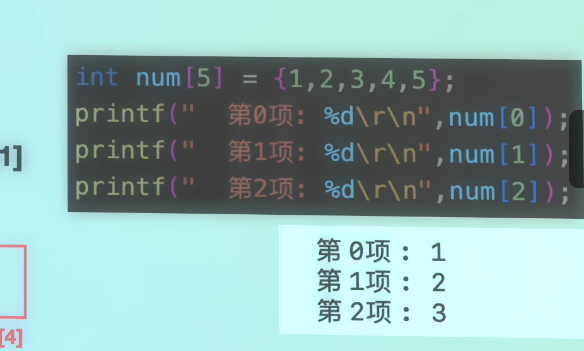
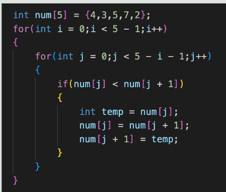

# 数组（Arrays）

数组是一组类型相同、在内存中连续存放的数据。它适合保存并统一处理多个同类型的值。

## 1. 数组基础

### 1.1 声明与初始化

声明数组时需要写出元素类型、数组名和元素数量：

```c
int numbers[5];
```

也可以在声明时初始化：

```c
int numbers[5] = {1, 2, 3, 4, 5};
```

如果提供了全部初始值，可以省略数组长度，让编译器自动计算：

```c
int numbers[] = {1, 2, 3, 4, 5};
```

### 1.2 数组下标

数组下标从 `0` 开始。长度为 `5` 的数组，其有效下标是 `0–4`：

```c
numbers[0] = 10;
printf("%d\n", numbers[0]);
```



访问下标范围以外的位置属于越界访问，会导致未定义行为。C 语言不会自动替你检查数组是否越界。

## 2. 循环与数组

数组经常与循环一起使用。可以通过循环读取或输出每一个元素：

```c
for (int i = 0; i < 4; i++)
{
    scanf("%d", &numbers[i]);
}
```

循环条件应使用 `< 数组长度`，因为最后一个有效下标比数组长度小 `1`。

## 3. 冒泡排序

冒泡排序会反复比较相邻元素，并在顺序不符合要求时交换它们。

本课代码使用下面的条件进行交换：

```c
if (numbers[j] < numbers[j + 1])
```

左侧元素较小时进行交换，因此最终结果是从大到小排列。如果改为 `>`，则会从小到大排列。



外层循环决定比较轮数，内层循环完成相邻元素比较。每完成一轮，就有一个元素到达最终位置，所以内层循环范围可以逐轮缩短。

## 4. 数组名与地址

在大多数表达式中，数组名会转换为指向首元素的指针，因此下面两个地址相同：

```c
numbers
&numbers[0]
```

更准确地说，数组名不是普通的指针变量；它只是会在多数使用场景中转换为首元素地址。例如，对数组使用 `sizeof` 时，得到的是整个数组占用的字节数，而不是指针大小。

## 5. 使用字符数组保存字符串

C 语言字符串本质上是以空字符 `\0` 结尾的字符数组：

```c
char text[20] = "Hello";
```

数组需要额外留出一个位置保存结尾的 `\0`，因此长度为 `20` 的字符数组最多安全保存 `19` 个普通字符。

使用 `scanf()` 读取单个不含空格的字符串时，数组名可以直接作为参数，不需要添加 `&`：

```c
char text[20];
scanf("%19s", text);
```

`%19s` 限制最多读取 `19` 个字符，为结尾的 `\0` 留出空间。普通 `%s` 没有长度限制，输入过长会造成数组越界。

数组声明完成后，不能用赋值运算符给整个字符串重新赋值：

```c
char text[20];
/* text = "Hello";  错误 */
```

可以在定义时初始化，或者包含 `<string.h>` 后使用 `strcpy()`：

```c
strcpy(text, "Hello");
```

使用 `strcpy()` 前必须确认目标数组有足够空间。

## 6. 注释

单行注释从 `//` 开始，只影响当前行：

```c
// This is a single-line comment.
```

多行注释位于 `/*` 和 `*/` 之间：

```c
/* This comment
   spans multiple lines. */
```

## 7. 二维数组

二维数组可以看作由多行、多列组成的数据表：

```c
int matrix[2][3] = {
    {1, 2, 3},
    {4, 5, 6}
};
```

访问元素时需要提供行下标和列下标：

```c
printf("%d\n", matrix[1][2]);
```

上面的输出是 `6`。遍历二维数组通常需要使用两层嵌套循环。

## 8. 本课程序

源代码：[`array_examples.c`](array_examples.c)

程序完成了：

- 使用循环读取和输出数组元素。
- 使用冒泡排序将整数从大到小排列。
- 使用字符数组保存字符串。
- 使用 `strcpy()` 复制字符串。

## 学习小结

- [x] 能够声明、初始化和访问一维数组
- [x] 理解数组下标从 `0` 开始
- [x] 能够使用循环处理数组元素
- [x] 初步理解冒泡排序
- [x] 理解数组名与首元素地址的关系
- [x] 能够使用字符数组保存字符串
- [x] 认识单行注释、多行注释和二维数组
