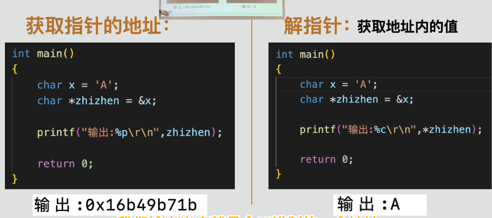
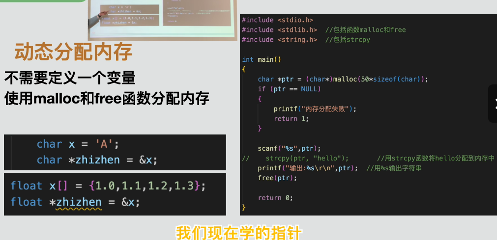

# 指针与动态内存（Pointers and Dynamic Memory）

指针是一种保存内存地址的变量。通过指针，可以间接读取或修改该地址中保存的数据。

## 1. 指针基础

声明指针时，需要写出它所指向数据的类型：

```c
int number = 10;
int *pointer = &number;
```

- `int *`：表示指向 `int` 数据的指针类型。
- `pointer`：指针变量名。
- `&number`：变量 `number` 的地址。

指针保存的是地址，不是变量本身的数据。

## 2. 取地址与解引用

### 2.1 取地址运算符 `&`

`&` 可以取得变量的内存地址：

```c
int number = 10;
int *pointer = &number;
```

### 2.2 解引用运算符 `*`

对指针使用 `*`，可以访问它所指地址中的数据：

```c
printf("%d\n", *pointer);
*pointer = 20;
```

第二条语句会通过指针把 `number` 修改为 `20`。



打印指针地址时使用 `%p`，并将指针转换为 `void *`：

```c
printf("%p\n", (void *)pointer);
```

## 3. 指针必须指向有效地址

不能解引用未初始化、已经失效或值为 `NULL` 的指针：

```c
int *pointer;  /* 尚未初始化，不能使用 *pointer。 */
```

正确做法是先让指针指向一个有效对象：

```c
int number = 10;
int *pointer = &number;
```

如果暂时没有指向对象，可以初始化为 `NULL`，并在使用前检查：

```c
int *pointer = NULL;
```

## 4. 指针与数组

在大多数表达式中，数组名会转换为指向首元素的指针：

```c
int numbers[4] = {10, 20, 30, 40};
int *pointer = numbers;
```

下面两种写法都能访问第一个元素：

```c
numbers[0]
*pointer
```

### 4.1 指针算术

指针加 `1` 会移动到下一个同类型元素，而不是简单增加一个字节：

```c
pointer++;
printf("%d\n", *pointer); /* 输出第二个元素。 */
```

移动的实际字节数由指针所指类型决定。例如，`int *` 加 `1` 会前进一个 `int` 元素的距离。

指针运算只能在同一个数组及其末尾后一位置的范围内进行，不能随意跳到不相关的内存区域。

## 5. 使用指针传递参数

C 语言的参数始终按值传递。把指针作为参数时，传递的是地址值的副本，但函数仍然可以通过这个地址修改调用者的数据：

```c
void increase_value(int *value)
{
    *value = *value + 1;
}

int number = 10;
increase_value(&number);
```

调用结束后，`number` 的值变为 `11`。

普通返回值适合把一个计算结果交还给调用者；指针参数适合修改调用者已有的数据，或处理数组等一组数据。两种方式可以在同一个函数中同时使用。

## 6. 字符数组与指针参数

字符数组作为函数参数时会转换为指向首字符的指针：

```c
void write_message(char *destination)
{
    strcpy(destination, "hello world");
}
```

调用者必须保证目标数组空间足够大，否则 `strcpy()` 会造成越界写入。

## 7. 动态内存分配

动态内存允许程序在运行时申请所需大小的内存。使用 `malloc()` 和 `free()` 需要包含 `<stdlib.h>`。



### 7.1 使用 `malloc()` 申请内存

```c
int *numbers = malloc(5 * sizeof(*numbers));
```

- `malloc()` 返回新内存块的起始地址。
- `sizeof(*numbers)` 表示一个数组元素所占的字节数。
- 在 C 语言中，不需要强制转换 `malloc()` 的返回值。

动态分配并不是“不需要变量”，仍然需要一个指针保存内存地址，否则无法安全使用和释放这块内存。

### 7.2 检查分配结果

内存分配可能失败，因此必须检查返回值：

```c
if (numbers == NULL)
{
    return 1;
}
```

### 7.3 使用 `free()` 释放内存

不再需要动态内存时，必须释放：

```c
free(numbers);
numbers = NULL;
```

`free()` 后不能继续解引用原指针。把它设为 `NULL` 可以减少误用已经释放内存的风险。

每一块成功申请的动态内存通常都应有对应的 `free()`，否则可能产生内存泄漏。

## 8. 嵌入式学习提示

指针在 MCU 开发中非常重要，常用于：

- 修改函数外部的数据。
- 处理数组、字符串和结构体。
- 访问内存映射寄存器。
- 操作外设缓冲区和 DMA 数据。

但寄存器地址必须来自芯片头文件或官方手册，不能随意构造并解引用未知地址。

动态内存在资源有限的 MCU 中需要谨慎使用。很多嵌入式项目会优先采用静态分配，避免内存碎片和分配失败带来的不确定性。

## 9. 本课程序

源代码：[`pointer_examples.c`](pointer_examples.c)

程序演示了：

- 声明并初始化指针。
- 使用 `%p` 输出地址。
- 通过解引用读取和修改数据。
- 使用指针遍历数组元素。
- 使用指针参数修改调用者的数据。
- 使用 `malloc()` 申请内存并用 `free()` 释放。

## 学习小结

- [x] 理解指针保存的是内存地址
- [x] 能够使用 `&` 取地址并使用 `*` 解引用
- [x] 理解指针与数组的关系
- [x] 能够进行基础指针算术
- [x] 能够使用指针参数修改外部数据
- [x] 能够检查、使用并释放动态内存
