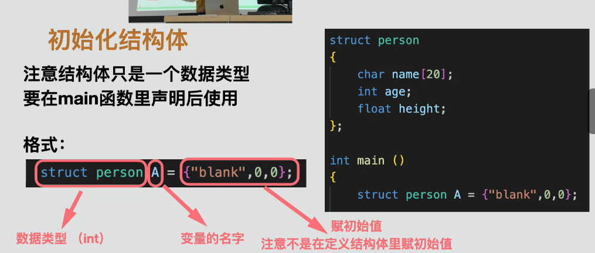
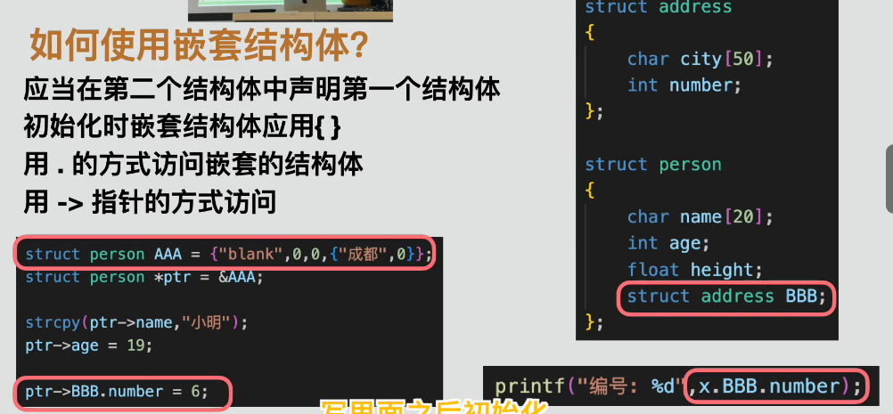

# 结构体（Structures）

结构体是用户自定义的数据类型，可以把多个相关、类型可以不同的数据组合成一个整体。

例如，一个人的姓名、年龄和身高分别属于字符串、整数和浮点数，但可以统一保存在一个 `person` 结构体中。

## 1. 定义结构体

使用 `struct` 定义结构体类型：

```c
struct person
{
    char name[20];
    int age;
    float height;
};
```

- `person` 是结构体标签，用于表示这种结构体类型。
- `name`、`age` 和 `height` 是结构体成员。
- 每个成员都需要写明自己的数据类型。
- 结构体定义结尾必须写分号 `;`。

定义结构体类型只是描述数据布局，不会自动创建一个保存数据的变量。

## 2. 声明与初始化结构体变量

定义类型后，可以声明结构体变量：

```c
struct person student;
```

也可以在声明变量时初始化：

```c
struct person student = {"张三", 20, 1.75f};
```



初始化值默认按照成员在结构体中的声明顺序依次对应。为了避免顺序错误，C 语言还支持指定成员初始化：

```c
struct person student = {
    .name = "张三",
    .age = 20,
    .height = 1.75f
};
```

## 3. 使用 `.` 访问结构体成员

普通结构体变量使用点运算符 `.` 访问成员：

```c
printf("%d\n", student.age);
student.age = 21;
```

数值成员可以直接使用 `=` 赋值，但字符数组成员不能在声明完成后整体使用 `=` 赋字符串：

```c
strcpy(student.name, "李四");
```

使用 `strcpy()` 需要包含 `<string.h>`，并确保目标数组空间足够。

## 4. 结构体与函数

结构体可以作为函数参数：

```c
void print_person(struct person person)
{
    printf("%s\n", person.name);
}
```

这种写法按值传递结构体，函数会得到整个结构体的一份副本。函数内部修改副本不会影响原结构体，但结构体较大时复制会增加开销。

也可以传递结构体地址：

```c
void update_age(struct person *person)
{
    person->age = 21;
}
```

指针参数可以修改调用者的原结构体，也避免复制整个结构体。如果函数只读取、不修改结构体，可以使用指向常量的指针：

```c
void print_person(const struct person *person);
```

## 5. 使用 `->` 访问结构体指针

指向结构体的指针使用箭头运算符 `->` 访问成员：

```c
struct person *person_pointer = &student;

person_pointer->age = 21;
```

它等价于：

```c
(*person_pointer).age = 21;
```

由于 `.` 的优先级高于 `*`，后一种写法必须加圆括号。

## 6. 嵌套结构体

结构体成员本身也可以是另一个结构体：

```c
struct address
{
    char city[20];
    char street[20];
};

struct person
{
    char name[20];
    int age;
    struct address home_address;
};
```

作为成员使用前，`struct address` 必须已经完整定义。

初始化嵌套结构体时，可以使用嵌套的花括号：

```c
struct person student = {
    "张三",
    20,
    {"北京", "长安街"}
};
```



普通变量使用连续的 `.` 访问嵌套成员：

```c
student.home_address.city
```

结构体指针先使用 `->`，嵌套的普通成员再使用 `.`：

```c
person_pointer->home_address.city
```

## 7. 结构体赋值

相同结构体类型的变量可以整体赋值：

```c
struct person first = {"张三", 20, 1.75f};
struct person second;

second = first;
```

这会复制所有成员。之后修改 `second` 的普通成员不会改变 `first`。

## 8. 内存与嵌入式提示

结构体成员通常按声明顺序存放，但编译器可能为了对齐在成员之间加入填充字节。因此，结构体占用的总字节数不一定等于各成员大小简单相加的结果，可以用 `sizeof` 查看：

```c
printf("%zu\n", sizeof(struct person));
```

在 STM32 开发中，结构体经常用于：

- 保存传感器数据。
- 组织外设配置参数。
- 描述通信数据帧。
- 管理设备状态。
- 表示 HAL 库中的外设句柄。

不要在不了解对齐、字节序和协议格式时，直接把普通结构体内存当作通信数据发送。

## 9. 本课程序

源代码：[`structures_example.c`](structures_example.c)

程序演示了：

- 定义并初始化结构体变量。
- 使用 `.` 和 `->` 访问结构体成员。
- 使用 `strcpy()` 修改字符数组成员。
- 把结构体按值传递给函数。
- 定义、初始化和访问嵌套结构体。

## 学习小结

- [x] 理解结构体类型、结构体变量和成员的区别
- [x] 能够定义并初始化结构体
- [x] 能够使用 `.` 和 `->` 访问成员
- [x] 能够把结构体或结构体指针传给函数
- [x] 能够定义和使用嵌套结构体
- [x] 初步了解结构体复制、内存对齐和嵌入式用途
