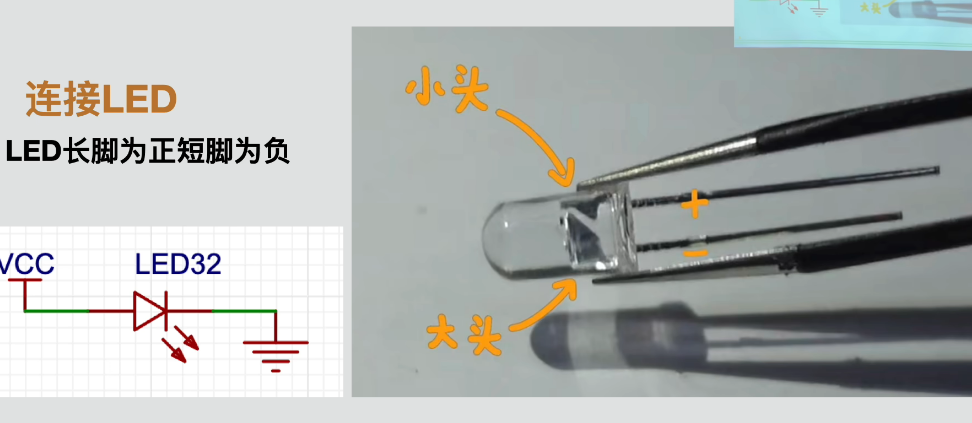
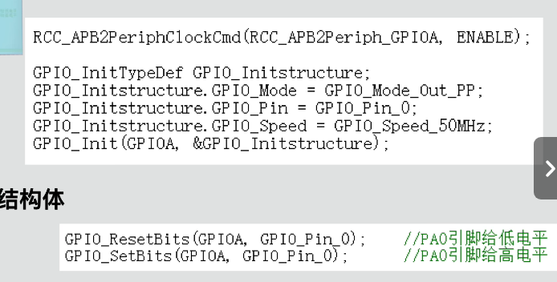
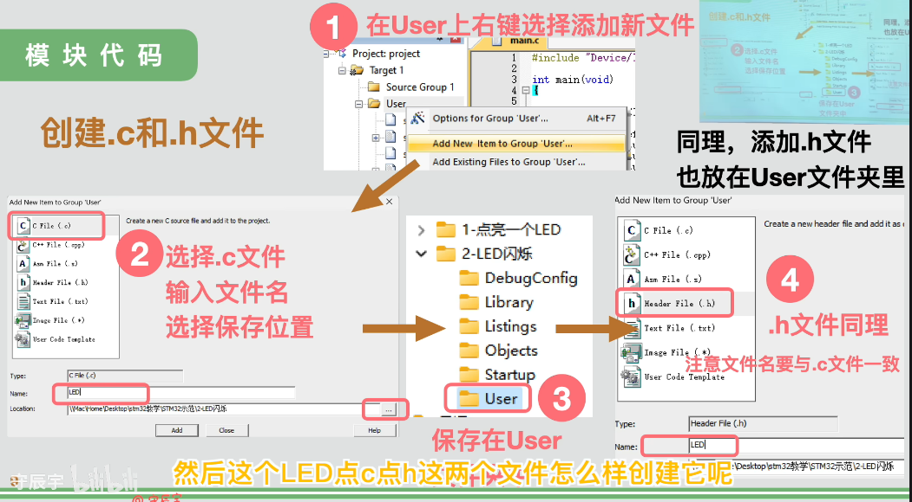
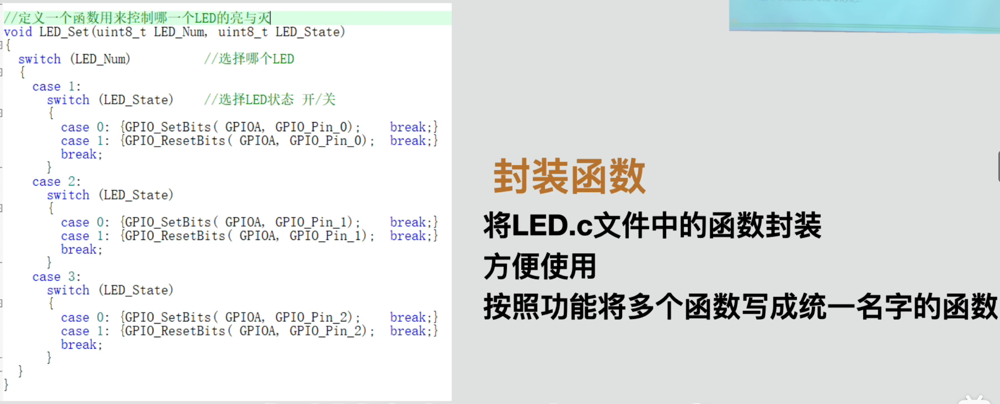

# STM32 GPIO LED Blinking

## 学习目标

- 使用 STM32F103 标准外设库配置 GPIO 推挽输出。
- 理解 `GPIO_SetBits()` 与 `GPIO_ResetBits()` 的含义。
- 使用 SysTick 编写微秒、毫秒和秒级阻塞延时。
- 将 LED 驱动和延时功能拆分成独立的 `.c`、`.h` 文件。
- 通过统一接口控制四个 LED 依次点亮和熄灭。

## 硬件连接

本实验使用四个 GPIO 引脚：

| LED | GPIO 引脚 |
| --- | --- |
| LED 1 | PA0 |
| LED 2 | PA1 |
| LED 3 | PB0 |
| LED 4 | PB1 |

每个 LED 均按以下方式连接：

```text
3.3V -> 限流电阻 -> LED 正极 -> LED 负极 -> GPIO
```

LED 必须串联限流电阻，建议使用 `220Ω` 至 `1kΩ`。



*图 1：课程中的 LED 正负极识别与连接示意。*

## 高低电平与 LED 状态

`GPIO_SetBits()` 表示让指定 GPIO 引脚输出高电平，`GPIO_ResetBits()` 表示输出低电平。函数名称只描述 GPIO 的电平，不直接代表 LED 的亮灭。

本实验采用低电平点亮，因此：

| GPIO 状态 | 调用方式 | 电路现象 | LED 状态 |
| --- | --- | --- | --- |
| 高电平 | `GPIO_SetBits()` | LED 两端电压接近 0 V | 熄灭 |
| 低电平 | `GPIO_ResetBits()` | 电流从 3.3 V 流向 GPIO | 点亮 |

在驱动接口中约定：

```c
LED_Set(LED_1, LED_ON);   // 点亮 LED 1
LED_Set(LED_1, LED_OFF);  // 熄灭 LED 1
```

调用者只需要表达“哪个 LED”和“亮还是灭”，具体使用高电平还是低电平由 `LED_Set()` 内部处理。

## GPIO 初始化流程

1. 使用 `RCC_APB2PeriphClockCmd()`开启 GPIOA 和 GPIOB 时钟。
2. 在切换到输出模式前先将输出锁存器置为高电平，避免 LED 初始化时短暂亮起。
3. 将 PA0、PA1、PB0、PB1 配置为 `GPIO_Mode_Out_PP` 推挽输出。
4. 使用 `GPIO_Speed_50MHz` 设置 GPIO 最大翻转速度；它并不代表 LED 会以 50 MHz 闪烁。



*图 2：课程中的 GPIO 初始化及高低电平控制示例。*

## 延时原理

`Delay_us()` 使用 Cortex-M3 的 SysTick 定时器产生阻塞延时。系统时钟为 72 MHz 时，每微秒约经过 72 个时钟周期。

```c
Delay_us(1000);  // 约 1 ms
Delay_ms(1000);  // 约 1 s
Delay_s(1);      // 约 1 s
```

这种延时会让 CPU 原地等待，适合当前入门实验；学习定时器和中断后，应避免在复杂程序中大量使用阻塞延时。

## 程序执行过程

```text
初始化 GPIO，默认关闭四个 LED
        ↓
点亮 LED 1，等待 1 秒，然后关闭
        ↓
点亮 LED 2，等待 1 秒，然后关闭
        ↓
点亮 LED 3，等待 1 秒，然后关闭
        ↓
点亮 LED 4，等待 1 秒，然后关闭
        ↓
回到 LED 1，循环执行
```

## 为什么要拆分文件

- `main.c`：描述程序整体执行流程。
- `LED.h`：声明 LED 对外提供的函数和名称宏。
- `LED.c`：封装 GPIO 与 LED 的具体对应关系。
- `Delay.h`：声明延时函数。
- `Delay.c`：实现 SysTick 延时。

这样更换 LED 引脚或改变高低电平逻辑时，只需要修改 LED 驱动，不必改动 `main.c`。



*图 3：在 Keil 的 User 分组中创建并添加 `.c`、`.h` 文件。*



*图 4：课程展示的 LED 控制函数封装思路。*

## 本次更正记录

- 为外层 `switch` 补齐控制流程，避免 `case` 连续向下执行。
- 使用 `LED_Set()` 代替 `main.c` 中直接操作 GPIO，保持模块封装。
- 使用 `LED_1`、`LED_ON` 等名称代替含义不清晰的数字参数。
- 初始化时明确关闭所有 LED。
- 为头文件使用的定宽整数类型补充 `<stdint.h>`。

## 工程结构

```text
keil-project/
├── project.uvprojx   # Keil 工程文件
├── project.uvoptx    # Keil 工程选项
├── USer/
│   ├── main.c        # 程序入口
│   ├── LED.c         # LED 驱动实现
│   ├── LED.h         # LED 函数声明和控制宏
│   ├── Delay.c       # SysTick 延时实现
│   └── Delay.h       # 延时函数声明
├── Library/          # STM32 标准外设库
└── Startup/          # CMSIS、设备头文件和启动文件
```

编译生成的 `Objects/` 和 `Listings/` 没有上传，可在本地重新编译生成。

## 打开工程

使用 Keil 5 打开：

```text
keil-project/project.uvprojx
```

完成编译和下载，并确认 GPIO、LED 极性及限流电阻连接正确后，即可观察四个 LED 依次闪烁。
