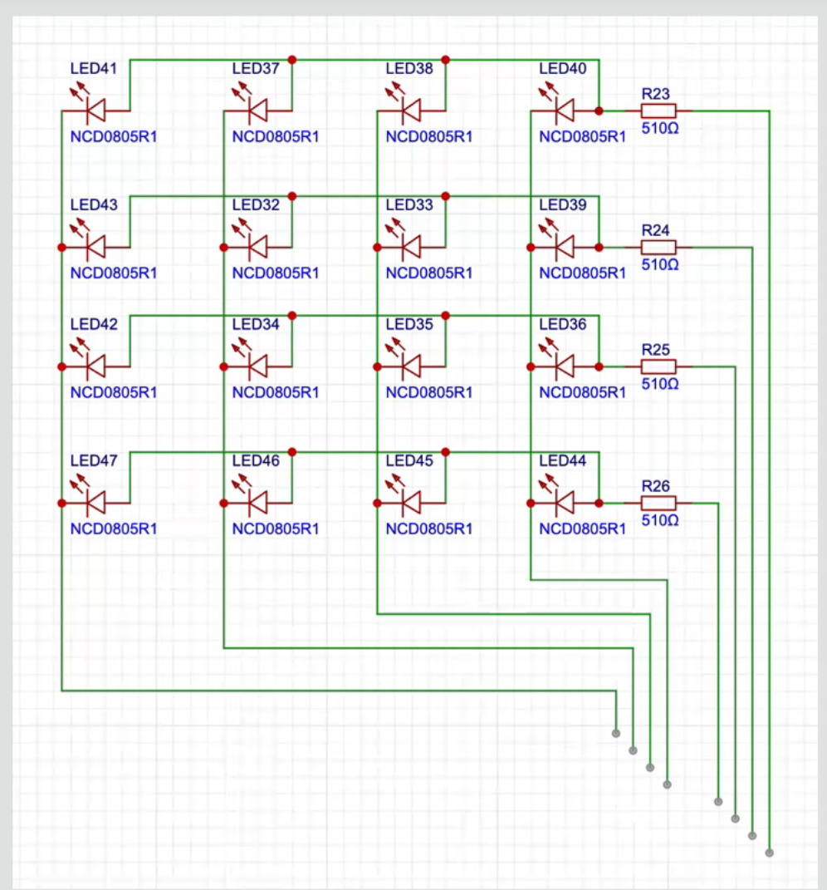
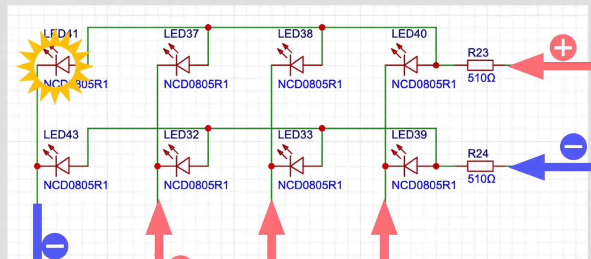

# 02 - LED 矩阵

本节使用 STM32F10x 标准外设库控制一个 4×4 LED 矩阵，重点理解矩阵的行列连接、GPIO 电平与 LED 点亮条件，以及为什么快速轮流点亮可以形成连续显示效果。

> 本文以 `keil-project` 中的 Keil 5 工程和源码为准。学习代码保持原样，本文只对其工作过程进行说明。

## 1. 学习目标

- 理解 LED 矩阵为什么能用较少的 GPIO 控制较多的 LED。
- 理解 `GPIO_SetBits()` 和 `GPIO_ResetBits()` 在当前电路中的作用。
- 根据行、列引脚找到一个 LED 的点亮条件。
- 理解当前程序如何让 LED41 与 LED32 轮流点亮。
- 初步认识动态扫描和视觉暂留。

## 2. LED 矩阵的基本原理

4×4 LED 矩阵共有 16 个 LED，但不是为每个 LED 单独准备两个引脚，而是让同一行、同一列的 LED 共用导线。因此只需要 4 根行线和 4 根列线，共 8 个 GPIO。



在本次接线中：

| 方向 | 从哪个位置开始 | GPIO 对应关系 | 当前作用 |
| --- | --- | --- | --- |
| 列 | 从左到右 | PA0、PA1、PA2、PA3 | 阴极，输出低电平时提供电流回路 |
| 行 | 从下到上 | PA4、PA5、PA6、PA7 | 阳极，输出高电平时提供电流 |

一个 LED 只有在它所在的行输出高电平、所在的列输出低电平时才会点亮。可以把它记成：

```text
选中一行（高电平） + 选中一列（低电平） = 对应 LED 点亮
```

例如 LED41 位于最上面一行、最左边一列，所以需要 PA7 为高电平、PA0 为低电平。



## 3. GPIO 初始化

当前程序打开了 GPIOA 的时钟，并把 PA0～PA7 配置为 50 MHz 推挽输出：

```c
RCC_APB2PeriphClockCmd(RCC_APB2Periph_GPIOA, ENABLE);

GPIO_InitTypeDef GPIO_Initstructure;
GPIO_Initstructure.GPIO_Mode = GPIO_Mode_Out_PP;
GPIO_Initstructure.GPIO_Pin = GPIO_Pin_0 | GPIO_Pin_1 |
                              GPIO_Pin_2 | GPIO_Pin_3 |
                              GPIO_Pin_4 | GPIO_Pin_5 |
                              GPIO_Pin_6 | GPIO_Pin_7;
GPIO_Initstructure.GPIO_Speed = GPIO_Speed_50MHz;
GPIO_Init(GPIOA, &GPIO_Initstructure);
```

程序中也开启了 GPIOB 时钟，但当前矩阵显示逻辑没有使用 GPIOB 引脚。

## 4. 当前程序的显示过程

### 4.1 点亮 LED41

程序先把 PA7、PA1、PA2、PA3 设为高电平，再把 PA0、PA4、PA5、PA6 设为低电平。

其中真正决定 LED41 点亮的是：

```text
PA7 = 高电平（最上面一行）
PA0 = 低电平（最左边一列）
```

LED41 点亮后保持 `500 ms`。

### 4.2 关闭并点亮 LED32

程序先关闭上一次选中的高电平行列，然后把 PA6、PA3、PA2、PA0 设为高电平，把 PA1、PA4、PA5、PA7 设为低电平。

其中真正决定 LED32 点亮的是：

```text
PA6 = 高电平（从下往上的第 3 行）
PA1 = 低电平（从左往右的第 2 列）
```

LED32 同样保持 `500 ms`，随后被关闭，程序回到开头继续循环。

因此当前 Keil 程序的实际效果是：

```text
LED41 点亮 0.5 秒
        ↓
LED41 关闭
        ↓
LED32 点亮 0.5 秒
        ↓
LED32 关闭
        ↓
重复
```

## 5. `SetBits` 与 `ResetBits` 不能直接等同于开灯和关灯

```c
GPIO_SetBits(GPIOA, GPIO_Pin_7);
```

表示 PA7 输出高电平。

```c
GPIO_ResetBits(GPIOA, GPIO_Pin_0);
```

表示 PA0 输出低电平。

它们只负责改变 GPIO 电平。LED 是否点亮，还取决于 LED 的正负极方向、它所在的行列以及电流是否能形成回路。因此不能脱离电路直接记成“SetBits 就是亮、ResetBits 就是灭”。

## 6. 动态扫描与视觉暂留

程序无法在同一时刻执行两条语句，所以两个 LED 实际上是先后被控制的。如果切换速度足够快，人眼会因为视觉暂留而感觉多个 LED 同时亮着，这就是动态扫描的基础。

本程序每个 LED 保持 500 ms，肉眼能明显看到交替。如果要让两个 LED 看起来同时常亮，可以把每个 LED 的点亮时间缩短到几毫秒，并不断快速扫描；如果希望它们在电气意义上同时亮，则需要根据矩阵电路同时选中相应行列，并检查是否会意外点亮其他交叉位置。

## 7. 工程结构

```text
02-led-matrix/
├─ readme.md
├─ image.png
├─ image-1.png
└─ keil-project/
   ├─ project.uvprojx
   ├─ Library/
   ├─ Startup/
   └─ USer/
      ├─ main.c
      ├─ Delay.c
      └─ Delay.h
```

Keil 5 中打开 `keil-project/project.uvprojx` 即可查看和编译工程，主要学习代码位于 `keil-project/USer/main.c`。

## 8. 本节小结

- LED 矩阵通过行列复用减少 GPIO 数量。
- 当前接线中，行高电平、列低电平时，对应交点的 LED 点亮。
- LED41 对应 PA7 高、PA0 低；LED32 对应 PA6 高、PA1 低。
- `GPIO_SetBits()` 与 `GPIO_ResetBits()` 只表示输出高、低电平，亮灭结果由电路连接决定。
- 当前程序让 LED41 和 LED32 各亮 500 ms，并不断交替。
