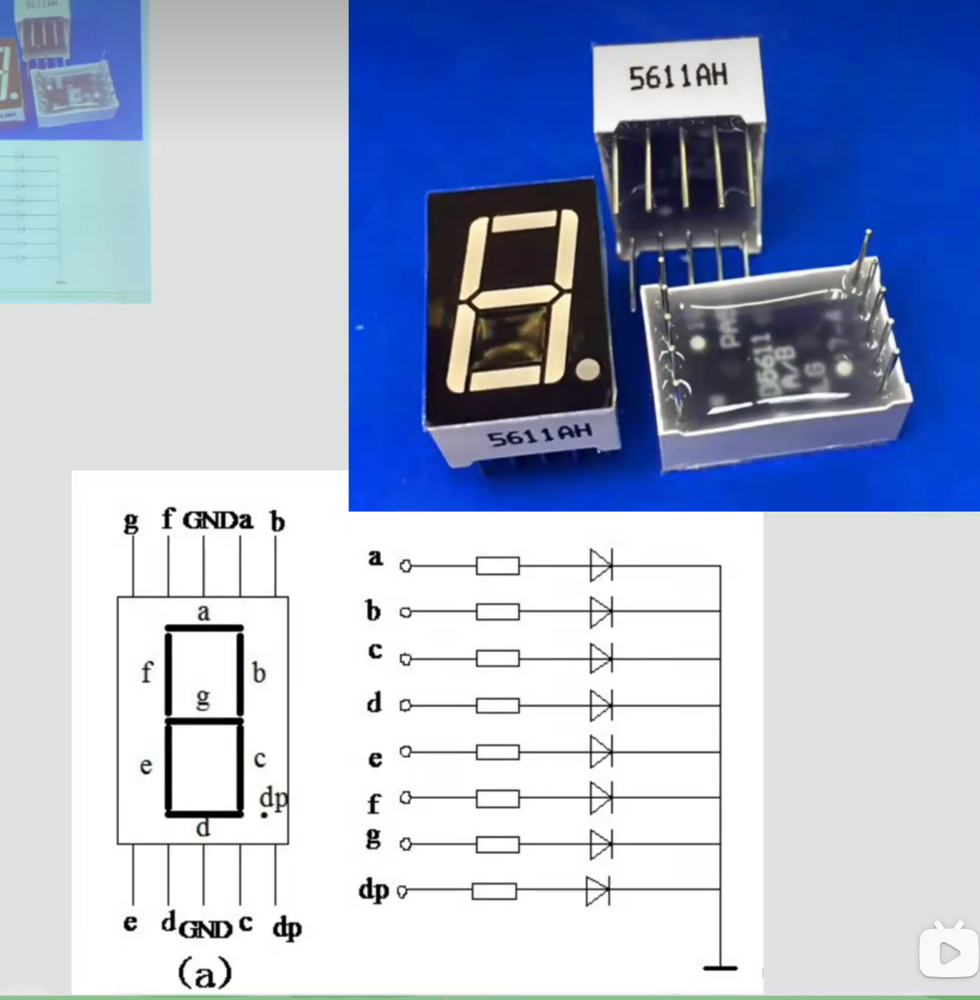
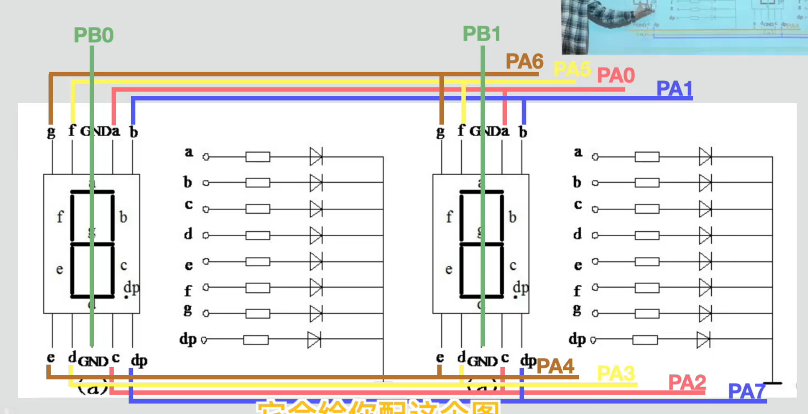

# 03 - 七段数码管

本节使用 STM32F10x 标准外设库控制一位共阳数码管，依次显示 `1、2、3、4、5、6、7、8、9、0`，每个数字保持 1 秒。

> 本文以 `keil-project` 中的 Keil 5 工程和源码为准。学习代码保持原样，本文只整理接线关系并解释程序的执行过程。

## 1. 学习目标

- 认识七段数码管的 `a～g` 段和小数点 `dp`。
- 区分共阳数码管与共阴数码管的控制电平。
- 理解 PB0 与 PA0～PA7 在当前接线中的作用。
- 理解用宏给 GPIO 引脚命名的好处。
- 理解 `switch` 如何选择不同数字对应的灯段组合。

## 2. 数码管的组成

一位数码管内部包含 8 个 LED：七个笔画段 `a、b、c、d、e、f、g`，以及一个小数点 `dp`。数字不是数码管自己“算”出来的，而是程序选择点亮哪些灯段后拼成的图形。



例如：

- 数字 `1`：点亮 `b、c`。
- 数字 `6`：点亮 `a、c、d、e、f、g`。
- 数字 `8`：点亮 `a、b、c、d、e、f、g`。

## 3. 本次接线关系

当前 Keil 程序采用以下连接：

| 数码管引脚 | STM32 引脚 | 作用 |
| --- | --- | --- |
| 公共阳极 | PB0 | 输出高电平，为数码管提供正电位 |
| a | PA0 | 顶部横段 |
| b | PA1 | 右上竖段 |
| c | PA2 | 右下竖段 |
| d | PA3 | 底部横段 |
| e | PA4 | 左下竖段 |
| f | PA5 | 左上竖段 |
| g | PA6 | 中间横段 |
| dp | PA7 | 小数点 |

接线参考图中还画出了第二位数码管的 PB1，但当前程序只控制一位数码管，所以只使用 PB0。



## 4. 为什么共阳数码管用低电平点亮

共阳数码管把各灯段 LED 的正极连接在一起。当前程序让 PB0 输出高电平，相当于给公共阳极提供正电位；某个段对应的 PA 引脚输出低电平时，电流才能从公共阳极流过 LED，再流向该 PA 引脚，于是该段点亮。

因此在本工程中：

```text
PB0 = 高电平：启用这一位数码管
PAx = 低电平：对应灯段点亮
PAx = 高电平：对应灯段熄灭
```

这就是代码中两类函数的实际含义：

```c
GPIO_ResetBits(GPIOA, SEG_A);  /* PA0 变为低电平，a 段点亮 */
GPIO_SetBits(GPIOA, SEG_A);    /* PA0 变为高电平，a 段熄灭 */
```

如果换成共阴数码管，电平关系通常相反，所以编程前必须先确认器件类型和接线。

## 5. 用宏表示灯段

程序开头使用宏把引脚名称换成更直观的灯段名称：

```c
#define SEG_A  GPIO_Pin_0
#define SEG_B  GPIO_Pin_1
#define SEG_C  GPIO_Pin_2
#define SEG_D  GPIO_Pin_3
#define SEG_E  GPIO_Pin_4
#define SEG_F  GPIO_Pin_5
#define SEG_G  GPIO_Pin_6
#define SEG_DP GPIO_Pin_7
```

宏不会创建新的变量。预处理时，编译器会把 `SEG_A` 替换为 `GPIO_Pin_0`。它的主要好处是让代码更接近电路含义：看到 `SEG_A | SEG_B` 就能直接理解为选择 a、b 两段，而不必反复记忆 PA0、PA1 分别接在哪里。

下面的宏把所有灯段组合在一起：

```c
#define SEG_ALL (SEG_A | SEG_B | SEG_C | SEG_D | \
                 SEG_E | SEG_F | SEG_G | SEG_DP)
```

这里的 `|` 是按位或，用于把多个 GPIO 引脚掩码合并，使一次函数调用可以同时控制多个引脚。

## 6. 初始化过程

程序依次完成以下工作：

1. 开启 GPIOA 和 GPIOB 的外设时钟。
2. 将 PA0～PA7 配置为推挽输出，用于控制 `a～g` 和 `dp`。
3. 将 PB0 配置为推挽输出，用于控制公共阳极。
4. 让 PB0 输出高电平，启用数码管。
5. 先让 PA0～PA7 全部输出高电平，确保所有灯段处于熄灭状态。

先全部熄灭是一个很实用的习惯，可以避免初始化后出现不确定的显示。

## 7. 数字与灯段组合

| 数字 | 需要点亮的灯段 |
| --- | --- |
| 0 | a、b、c、d、e、f |
| 1 | b、c |
| 2 | a、b、d、e、g |
| 3 | a、b、c、d、g |
| 4 | b、c、f、g |
| 5 | a、c、d、f、g |
| 6 | a、c、d、e、f、g |
| 7 | a、b、c |
| 8 | a、b、c、d、e、f、g |
| 9 | a、b、c、d、f、g |

以数字 `6` 为例：

```c
GPIO_ResetBits(GPIOA,
               SEG_A | SEG_C | SEG_D |
               SEG_E | SEG_F | SEG_G);
```

因为这是共阳数码管，`ResetBits` 把这些段的引脚拉低，从而点亮 `a、c、d、e、f、g`；没有被拉低的 `b` 段保持高电平，所以熄灭，最终组成数字 `6`。

## 8. `switch` 与循环显示过程

变量 `i` 的初始值为 `1`。每次进入 `while (1)` 后，程序执行以下流程：

```text
先熄灭所有灯段
        ↓
switch 根据 i 选择灯段组合
        ↓
显示当前数字 1 秒
        ↓
i 加 1
        ↓
i 大于 9 时变回 0
        ↓
继续下一轮
```

所以实际显示顺序为：

```text
1 → 2 → 3 → 4 → 5 → 6 → 7 → 8 → 9 → 0 → 1 → ……
```

这里使用的是 `Delay_s(1)`，因此当前 Keil 代码中每个数字显示 1 秒。

每个 `case` 末尾的 `break` 很重要。它会让程序执行完当前数字后跳出 `switch`，避免继续进入后面的数字分支。

## 9. 为什么每次都要先熄灭全部灯段

如果从数字 `8` 切换到数字 `1`，仅点亮 `b、c` 并不会自动关闭其他灯段，之前的 `a、d、e、f、g` 可能继续保持低电平。程序在每次显示新数字前执行：

```c
GPIO_SetBits(GPIOA, SEG_ALL);
```

先让所有段恢复高电平、全部熄灭，然后再拉低当前数字需要的段，就不会残留上一个数字的笔画。

## 10. 工程结构

```text
03-seven-segment-display/
├─ readme.md
├─ image-2.png
├─ image-3.png
└─ keil-project/
   ├─ project.uvprojx
   ├─ Library/
   ├─ Startup/
   └─ USer/
      ├─ main.c
      ├─ Delay.c
      └─ Delay.h
```

Keil 5 中打开 `keil-project/project.uvprojx` 即可查看和编译工程，主要学习代码位于 `keil-project/USer/main.c`。

## 11. 本节小结

- 一位数码管由 `a～g` 七个笔画段和 `dp` 小数点组成。
- 当前工程中 PB0 控制公共阳极，PA0～PA7 分别控制 `a～dp`。
- 共阳数码管在公共阳极为高电平时，用低电平点亮相应灯段。
- 宏让引脚名称具有明确的电路含义，按位或可以组合多个灯段。
- 当前程序通过 `switch` 选择灯段，每隔 1 秒按 `1～9、0` 的顺序循环显示。
