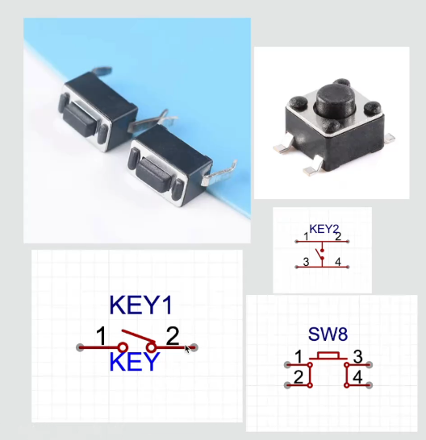
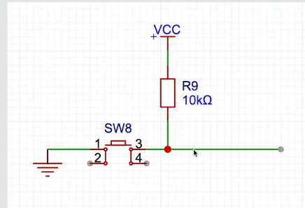
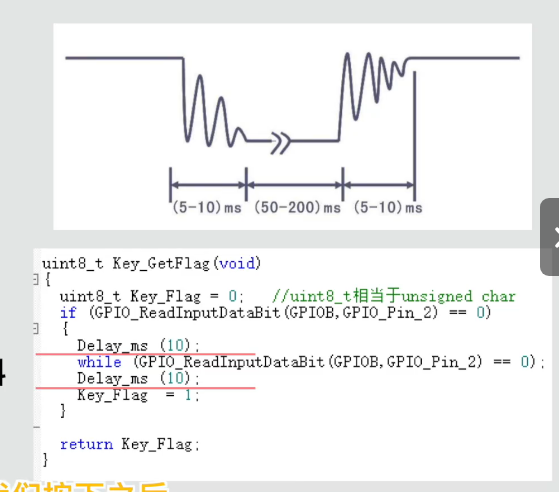
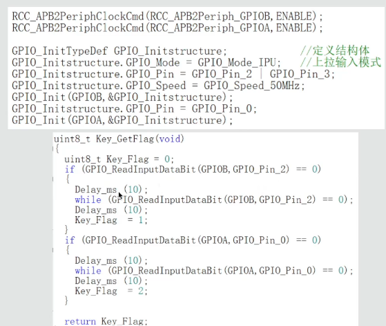

# 04 - 按键输入与数码管控制

本节使用两个独立按键控制数字加减，并将结果显示在两位共阳数码管上。每次有效按键还会翻转一次 LED 状态。

> 本文以 `keil-project` 中当前的 Keil 5 工程和源码为准。学习代码保持原样，README 只负责解释程序、接线和容易混淆的知识点。

## 1. 学习目标

- 理解独立按键按下和松开时 GPIO 电平为什么不同。
- 学会把 GPIO 配置为上拉输入 `GPIO_Mode_IPU`。
- 理解按键抖动以及延时消抖的基本方法。
- 理解“等待按键松手”为什么看起来像程序卡住。
- 使用两个按键分别实现数字加一和减一。
- 复习函数封装、LED 状态翻转和两位数码管动态扫描。
- 让 Keil 5 与 VS Code 直接编辑同一套源文件。

## 2. 独立按键的结构

常见轻触按键有两个引脚或四个引脚。四脚按键同一侧的两个引脚通常已经在内部相连，按下后左右两侧才接通。因此接线前最好使用万用表蜂鸣挡确认哪两个脚属于同一侧。



## 3. 上拉输入与按键电平

按键输入端不能悬空，否则引脚电平容易受到干扰而随机变化。上拉输入会让未按下时的引脚默认保持高电平；按键按下后，引脚通过按键接到 GND，变成低电平。



可以记成：

```text
松开按键：GPIO 被上拉到高电平，读取结果为 1
按下按键：GPIO 与 GND 接通，读取结果为 0
```

当前 Keil 代码使用 STM32 的内部上拉输入：

```c
GPIO_Initstructure.GPIO_Mode = GPIO_Mode_IPU;
GPIO_Initstructure.GPIO_Pin = GPIO_Pin_11 | GPIO_Pin_12;
GPIO_Init(GPIOB, &GPIO_Initstructure);
```

当前按键对应关系为：

| 按键 | STM32 引脚 | 按下时电平 | 程序功能 |
| --- | --- | --- | --- |
| 按键 1 | PB11 | 低电平 | 数字加一，并翻转 LED |
| 按键 2 | PB12 | 低电平 | 数字减一，并翻转 LED |

## 4. 为什么按键需要消抖

机械触点在按下和松开的瞬间不会立刻稳定，而会在几毫秒内快速接通、断开多次。如果程序直接高速读取，按一次可能被误判成按了多次。



当前程序使用的消抖流程是：

```text
第一次检测到低电平
        ↓
延时 10 ms，避开按下抖动
        ↓
持续等待按键松开
        ↓
再次延时 10 ms，避开松开抖动
        ↓
返回一次有效按键事件
```

对应的核心代码为：

```c
if (GPIO_ReadInputDataBit(GPIOB, GPIO_Pin_11) == 0)
{
    Delay_ms(10);
    while (GPIO_ReadInputDataBit(GPIOB, GPIO_Pin_11) == 0);
    Delay_ms(10);
    Flag = 1;
}
```

### 4.1 `while (... == 0);` 后面的分号有什么作用

这条 `while` 的循环体是空的。只要按键仍为低电平，CPU 就一直停在这里重复检测；直到松开按键、读取结果变成 1，程序才继续向下执行。

因此长按按键时，程序看起来会“卡住”。它并没有死机，而是在主动等待按键松开。这种写法叫阻塞式按键检测。

由于数码管需要在主循环中不断调用 `Seg_Set()` 才能动态扫描，等待松手期间扫描会暂停，可能出现短暂熄灭或显示不稳定。学习初期这种写法容易理解；以后学习定时器和状态机后，可以改成非阻塞式按键检测。

## 5. 按键函数的封装

按键功能被拆分到 `Key.c` 和 `Key.h`：

- `Key_Init()`：初始化 PB11、PB12 为上拉输入。
- `Key_GetFlag()`：检测 PB11，按下并松开后返回 1。
- `Key_GetFlag2()`：检测 PB12，按下并松开后返回 1。

函数返回 0 表示本轮没有新的按键事件，返回 1 表示完成了一次有效按下和松开。

这种封装让 `main.c` 不需要反复书写 GPIO 检测和消抖过程，只需要判断函数返回值。

下面的课件示例展示了同时配置多个 GPIO 输入并为不同按键返回不同编号的思路。图中的 PB2、PB3、PA0 是示例引脚；本工程的真实引脚仍以 Keil 源码中的 PB11、PB12 为准。



## 6. 主程序运行过程

程序启动时依次初始化按键、LED 和数码管：

```c
Key_Init();
LED_Init();
Seg_Init();
```

变量 `Number` 的初始值是 0。

### 6.1 按键 1：数字加一

```c
if (Key_GetFlag() == 1)
{
    LED_Turn();
    Number++;

    if (Number == 10)
    {
        Number = 0;
    }
}
```

每次按下并松开按键 1：

1. 调用 `LED_Turn()` 翻转 LED 状态。
2. `Number` 加一。
3. 从 9 加到 10 时重新变成 0。

数字变化顺序为：

```text
0 → 1 → 2 → 3 → 4 → 5 → 6 → 7 → 8 → 9 → 0
```

### 6.2 按键 2：数字减一

```c
if (Key_GetFlag2() == 1)
{
    LED_Turn();
    Number--;

    if (Number == -1)
    {
        Number = 9;
    }
}
```

每次按下并松开按键 2，数字减一。从 0 减到 -1 时重新变成 9。

数字变化顺序为：

```text
0 → 9 → 8 → 7 → 6 → 5 → 4 → 3 → 2 → 1 → 0
```

## 7. LED 状态翻转

`LED_Turn()` 首先读取 PA9 当前输出的电平：

```c
if (GPIO_ReadOutputDataBit(GPIOA, GPIO_Pin_9) == 1)
```

- 如果当前是高电平，就使用 `GPIO_ResetBits()` 改为低电平。
- 如果当前是低电平，就使用 `GPIO_SetBits()` 改为高电平。

这就是“翻转”：不直接指定必须开或关，而是根据当前状态切换到相反状态。

GPIO 高低电平与 LED 实际亮灭仍取决于硬件接法。如果 LED 正极接电源、负极接 PA9，那么低电平可能对应点亮；如果连接方向相反，亮灭逻辑也会相反。

## 8. 数码管显示

主循环最后不断调用：

```c
Seg_Set(Number, 0);
```

当前数码管模块使用两位共阳数码管动态扫描：

- PA0～PA7 控制 `a～g` 和 `dp`。
- PB0、PB1 控制两个数码管的公共阳极。
- 共阳数码管的段线输出低电平时点亮。
- 两位数码管各显示约 1 ms，然后快速切换。

`Number` 显示在第一位，第二位固定显示 0。`Seg_Set()` 必须在 `while (1)` 中不断执行，否则动态扫描停止后，显示可能闪烁或只剩一位。

## 9. 完整程序流程

```text
初始化按键、LED、数码管
        ↓
检测按键 1
  ├─ 有事件：LED 翻转，数字加一并处理 9→0
  └─ 无事件：继续
        ↓
检测按键 2
  ├─ 有事件：LED 翻转，数字减一并处理 0→9
  └─ 无事件：继续
        ↓
动态扫描显示 Number 和 0
        ↓
返回循环开头
```

## 10. 当前代码需要留意的地方

这些内容按 Keil 5 源码原样保留，没有在本次整理中修改：

1. `Key_GetFlag()` 和 `Key_GetFlag2()` 使用阻塞式等待松手，长按时主循环和数码管扫描会暂停。
2. `LED_Set()` 的外层 `switch` 各个 `case` 后没有单独的 `break`，调用它时可能继续执行后续分支；当前 `main.c` 使用的是 `LED_Turn()`，所以本节主要功能不依赖 `LED_Set()`。
3. C 语言必须使用英文半角符号。把 `if (` 误写成带中文全角括号的 `if（`，会出现 `expected a ";"` 一类编译错误。
4. 按键 1 和按键 2 是先后检测的；如果程序正在等待其中一个按键松开，暂时不会检测另一个按键。
5. `Key.c` 调用了 `Delay_ms()`，但当前文件没有包含 `Delay.h`，因此完整重编译会出现“函数被隐式声明”的警告；工程仍能链接成功。本次遵照“代码以 Keil 5 为准”的要求保留原样，后续学习时应养成在调用函数前包含对应头文件的习惯。

## 11. Keil 5 与 VS Code 使用同一套代码

本课程不在 VS Code 目录再复制一份源码。Keil 5 和 VS Code 都直接编辑下面这些文件：

```text
04-button/keil-project/USer/
├─ main.c
├─ Key.c
├─ Key.h
├─ LED.c
├─ LED.h
├─ Seg.c
├─ Seg.h
├─ Delay.c
└─ Delay.h
```

推荐使用方式：

- Keil 5：打开 `keil-project/project.uvprojx`，负责编译、下载和调试。
- VS Code：打开整个 `D:\embedded-mcu-learning` 文件夹，然后直接编辑 `04-button/keil-project/USer` 中的同一批文件。

两个软件操作的是相同磁盘文件，因此在其中一个软件保存后，另一个软件重新载入即可看到变化。不要把源文件另存到上一课文件夹，否则会再次产生两份不同版本。

## 12. 工程结构

```text
04-button/
├─ readme.md
├─ image.png
├─ image-1.png
├─ image-2.png
├─ image-3.png
└─ keil-project/
   ├─ project.uvprojx
   ├─ Library/
   ├─ Startup/
   └─ USer/
      ├─ main.c
      ├─ Key.c
      ├─ Key.h
      ├─ LED.c
      ├─ LED.h
      ├─ Seg.c
      ├─ Seg.h
      ├─ Delay.c
      └─ Delay.h
```

## 13. 本节小结

- 上拉输入状态下，按键松开通常读到 1，按下接地后读到 0。
- 机械按键会抖动，当前程序在按下和松开后分别延时 10 ms 消抖。
- `while (... == 0);` 会阻塞等待松手，并不是真正死机。
- 两个按键分别让数字在 0～9 范围内循环加一和减一。
- `LED_Turn()` 通过读取输出电平实现 LED 状态翻转。
- 两位数码管通过快速动态扫描显示数字。
- Keil 5 和 VS Code 直接编辑 `keil-project/USer` 中同一套源码，就不会发生同步问题。
